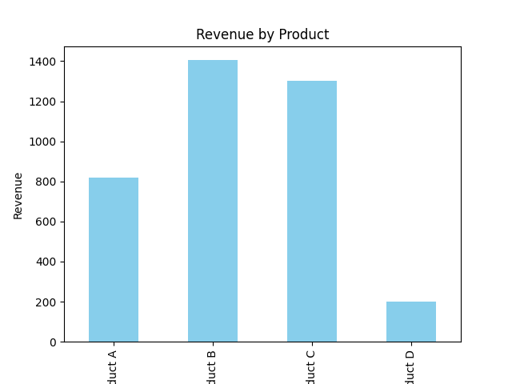
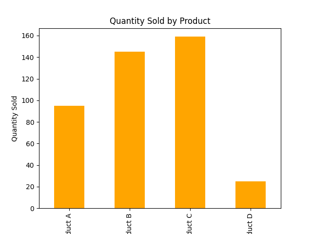

# 📊 Sales Analysis Using SQLite & Python

## 📌 Project Overview

This project focuses on analyzing sales data using SQLite and Python.

The analysis is performed to understand product-level sales performance, revenue generation, and quantity sold. Python is used for data generation and analysis, while SQLite is used for storing and querying the sales data.

The project also includes visualizations to present the analysis results clearly.

## 🎯 Objectives

- Generate and organize sales data
- Store sales data using SQLite
- Analyze sales data using SQL queries
- Calculate revenue by product
- Calculate quantity sold by product
- Identify top-performing products
- Create visualizations from the analysis results
- Extract useful business insights from sales data

## 🛠️ Tools & Technologies

- Python
- SQLite
- SQL
- Pandas
- Matplotlib
- Data Analysis
- Data Visualization

## 📂 Project Files

| File | Description |
|---|---|
| `create_sales_data.py` | Python script used to create the sales dataset |
| `task7_eda.py` | Python script used for exploratory data analysis |
| `quantity_by_product.png` | Visualization showing quantity sold by product |
| `revenue_by_product.png` | Visualization showing revenue by product |

## 🔄 Sales Analysis Workflow

```text
Generate Sales Data
        ↓
Store Data in SQLite
        ↓
Load and Query Sales Data
        ↓
Perform Exploratory Data Analysis
        ↓
Calculate Revenue by Product
        ↓
Calculate Quantity by Product
        ↓
Create Visualizations
        ↓
Generate Business Insights
```

📈 Analysis Performed

💰 Revenue Analysis



The project calculates the total revenue generated by each product.
This helps identify products that contribute more to overall sales revenue.

📦 Quantity Analysis



The project calculates the total quantity sold for each product.
This helps understand product demand and identify products with higher sales volume.

📊 Data Visualizations

Revenue by Product

The following visualization shows the revenue generated by different products.

Quantity by Product

The following visualization shows the quantity sold for different products.

💡 Key Insights

The analysis helps identify:
- Products generating higher revenue
- Products with higher sales quantity
- Differences in product-level performance
- Products with strong sales demand
- Areas that may require further business analysis
- Useful patterns in the sales data

🎓 Key Learning Outcomes

- Learned how to work with SQLite databases
- Practiced SQL-based data analysis
- Learned to perform exploratory data analysis using Python
- Practiced data manipulation using Pandas
- Learned to create charts using Matplotlib
- Improved understanding of revenue and quantity analysis
- Learned how to convert sales data into meaningful business insights

🚀 How to Run

1. Install Python
Make sure Python is installed on your system.

2. Install Required Libraries
pip install pandas matplotlib

3. Generate the Sales Data
Run:
python create_sales_data.py

4. Run the Analysis
Run:
python task7_eda.py

The analysis results and visualizations will be generated based on the sales data.

📌 Project Outcome

This project demonstrates how Python, SQLite, and data visualization techniques can be used together to analyze sales data.
The final analysis provides a clear understanding of product-level revenue and quantity performance and demonstrates the complete process from data preparation to business insights.

👨‍💻 Author

Raju Otlam
Aspiring Data Analyst
Skills: Python | SQL | SQLite | Excel | Power BI | Data Analysis | Data Visualization
